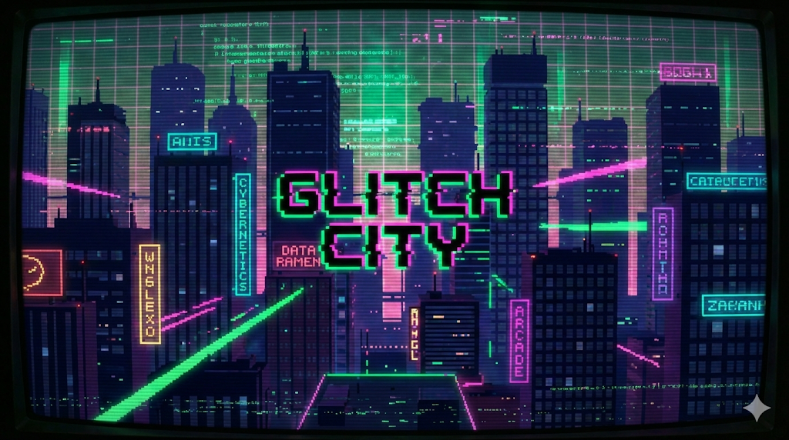

# GLITCH CITY 🏙️

> **A procedural cyberpunk survival game where you must outrun the system decay.**

## 🎮 How to Play

### Objective
Survive as long as possible while the city destabilizes around you.
- **Collect** Blue Data Fragments to restore your **Stability**.
- **Avoid** Red Glitch Patches and Enemies.
- **Survive** random System Events like Time Dilation, Color Shifts, and Inverted Controls.
- Keep your **Stability Meter** (top right) from reaching 0%!

### Controls

| Action | PC (Keyboard) | Mobile (Touch) |
| :--- | :--- | :--- |
| **Move** | `WASD` or `Arrow Keys` | Virtual D-Pad (Left side) |
| **Dash** | `SPACE` | Dash Button (Right side) |
| **Pause/Mute** | On-screen Buttons | On-screen Buttons |

> **Pro Tip:** Dashing gives you a brief moment of invulnerability. Use it to pass through enemies!

## 🕹️ Features

- **Endless Procedural World**: No two runs are the same. Level generation is infinite.
- **Dynamic Glitch System**: The world physically distorts, slows down, and changes colors as stability drops.
- **Procedural Audio**: A custom-built sound engine generates music and SFX in real-time using the Web Audio API. No external audio files!
- **Mobile Optimized**: Fully responsive with auto-scaling canvas and touch controls.
- **High Score**: Saves your best survival time and score locally.

## 🛠️ Development

Built entirely with **Vanilla JavaScript** and **HTML5 Canvas**.

- **No Game Engine**: Uses a custom Entity-Component-System (ECS) architecture.
- **No External Assets**: All graphics are drawn via Canvas API or are simple generated textures. All audio is synthesized.
- **Single File Build**: The `index.html` contains the entire game bundled for easy deployment.

### Running Locally
1. Clone this repository.
2. Open `index.html` in any modern web browser to play.
3. For development, open `dev_index.html` (requires a local web server due to ES Modules, e.g., VS Code Live Server).

## 👨‍💻 Credits

Developed by **Shourov Paul**.